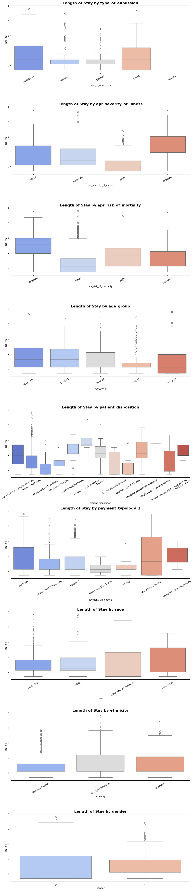
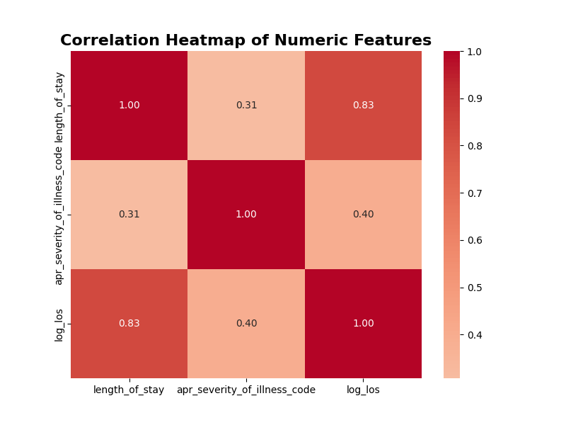
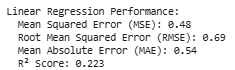
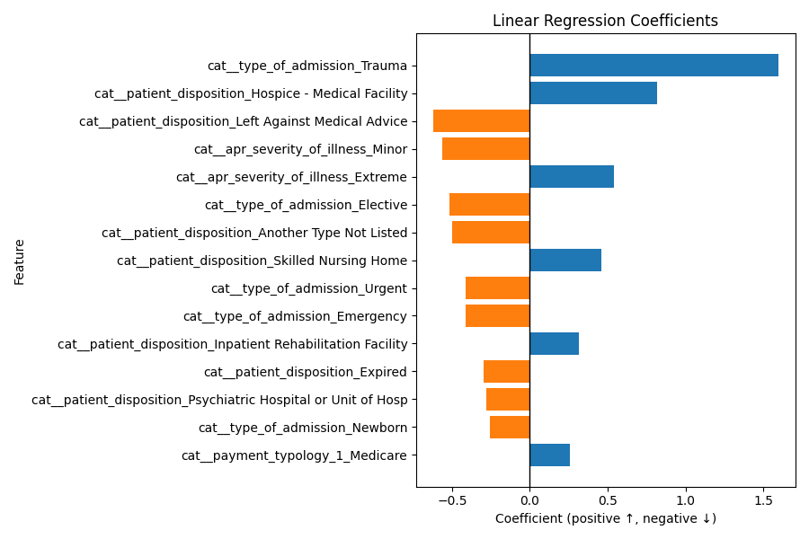

# Hospital Stay Duration Analysis

## Overview

This project analyzes a comprehensive hospital dataset from New York State to understand and predict the length of patient hospital stays. It involves exploratory data analysis, feature engineering, and predictive modeling using regression techniques.

Dataset Description: 
The dataset contains records of hospital stays including patient demographics, admission details, clinical severity scores, financial charges, and outcomes.

Dataset
- **Rows:** 1,000 (sample)  
- **Columns:** 33 originally → reduced to 22 after cleaning
  
## Notebooks
- [link to colab notebook code](https://colab.research.google.com/drive/1Bvc1XTSsyqYRLFSvz2UCU42tIPxt9cJB?usp=sharing)
## Data Description 
### Feature Groups

Patient Demographics
- age_group → Age ranges (e.g., 0–17, 18–29, 30–49, 50–69, 70+)Useful for grouping patients by age category.
- gender → Male/Female/Other. race → Race categories (White, Black, Asian/Pacific Islander, Other).
- ethnicity → Hispanic / Non-Hispanic.
- zip_code_3_digits → First 3 digits of patient ZIP (for geography).
Admission & Discharge Information
- type_of_admission → How patient was admitted: Emergency, Elective, Trauma, Newborn.
- patient_disposition → Status at discharge: home, rehab, skilled nursing, expired, transferred.
- emergency_department_indicator → Y/N if admitted via ED.
- discharge_year → Year of discharge (time-based trends).
Clinical Classifications
- ccsr_diagnosis_code / ccsr_diagnosis_description → Diagnosis category (based on ICD → CCSR grouping).
- ccsr_procedure_code / ccsr_procedure_description → Procedure category.
- apr_drg_code / apr_drg_description → All-Patient Refined DRG (Diagnosis Related Group).
- apr_mdc_code / apr_mdc_description → Major Diagnostic Category.
- apr_severity_of_illness_code / apr_severity_of_illness → Severity level (1=Minor, 2=Moderate, 3=Major, 4=Extreme).
- apr_risk_of_mortality → Mortality risk category (Minor, Moderate, Major, Extreme).
- apr_medical_surgical → Medical vs Surgical case.
Hospital Identifiers
- hospital_service_area → Regional service area.
- hospital_county → County where hospital is located.
- facility_name → Hospital facility name.
- operating_certificate_number, permanent_facility_id → Hospital identifiers.
Financial Variables
- payment_typology_1 / 2 / 3 → Primary, secondary, tertiary payer (Medicare, Medicaid, private insurance, self-pay).
- total_charges → Amount billed to patient/insurer.
- total_costs → Estimated hospital cost of the stay.
Outcome Variable
- length_of_stay → Number of days patient stayed in hospital (integer, sometimes capped as “120+”).
- Target for regression.
- Distribution is usually right-skewed (most short stays, few very long ones).

## Data Cleaning/Preprocessing

### Data Cleaning 
several columns were removed to ensure only meaningful and usable features were retained:
- **Identifiers:** `operating_certificate_number`, `permanent_facility_id`, `facility_name`  
- **Leakage-prone variables:** `total_charges`, `total_costs` (known only post-discharge)  
- **Sparse/Redundant:** `payment_typology_2`, `payment_typology_3`, `birth_weight`, `zip_code_3_digits`  
- **Overlapping:** `ccsr_procedure_code`, `ccsr_procedure_description`  

### Outlier Analysis

- Outlier analysis of the target variable (length_of_stay) shows a highly skewed distribution with most patients staying under 7 days, but a small fraction of admissions extending beyond 30 days (up to 120). These extreme cases are clinically valid and represent high-severity conditions rather than errors. For this project, we retain all values but apply a log transformation during modeling to reduce skewness and lessen the impact of extreme outliers on model performance.

### Preprocessing/Feature Engineering

#### Categorical Features
- Applied One-Hot Encoding to variables like type of admission, patient disposition, APR severity of illness, and risk of mortality.
- Used drop-first encoding for binary categories to prevent multicollinearity.

#### Numerical Features
- Retained integer-based fields such as severity codes and discharge year.
- Considered scaling (StandardScaler) for continuous variables to support algorithms sensitive to feature magnitude.

#### Feature Selection Considerations
- Dropped financial outcomes (total_charges, total_costs) since they are only known post-discharge.
- Removed identifiers (facility name, operating certificate number, permanent facility ID) that don’t provide predictive value.
- Excluded sparse or redundant fields (payment_typology_2/3, birth_weight, zip_code_3_digits, procedure codes) due to missingness or overlap with diagnosis/severity features.

#### Train/Test Split
- Split data into 80% training and 20% testing.
  
### EDA and Correlation Analysis

#### 1. Target Distribution
- The target variable is length_of_stay, defined as the total number of inpatient days per admission. LOS is a key hospital performance measure because it reflects resource utilization, patient complexity, and cost of care.

#### 2. Numerical Features Distrubution

##### Length of Stay (LOS):
- Distribution is right-skewed, with most patients staying 2–7 days.
- Median is 3 days, but a few outliers extend up to 120 days
- Capping or log-transforming LOS could help stabilize modeling.
##### Severity of Illness Code (numeric 1–4):
- LOS increases stepwise with the severity code.
- Acts as an ordinal variable and aligns well with the categorical severity labels.
- 

#### 3. Categorical Features Distrubution

##### Type of Admission:
- Emergency admissions dominate and show longer LOS on average.
- Elective admissions tend to be shorter, reflecting planned care.
- Newborn admissions are short but with some outliers.

##### Severity of Illness:
- Extreme severity patients have the longest median LOS.
- Clear gradient: Minor → Moderate → Major → Extreme.
- One of the strongest predictors of LOS.

##### Risk of Mortality:
- Higher mortality risk correlates with longer LOS, though extreme-risk patients show greater variability (some very short stays due to death).
- Strong complement to severity.

##### Age Group:
- Older patients (especially 70+) stay significantly longer.
- Younger groups (0–17, 18–29) show shorter stays.
- Age amplifies Medicare’s effect on LOS.

##### Patient Disposition:
- Home discharges have the shortest stays.
- Transfers to rehab/skilled nursing show much longer LOS.
- Expired patients show a split: some very short stays, others very long.

##### Payment Typology 1:
- Medicare patients have the longest stays, linked to age and comorbidities.
- Private insurance/self-pay generally result in shorter LOS.
- Reflects both demographic and system-level influences.

##### Gender
- The counts for "M" (male) and "F" (female) are very similar, each just under or above 500. This indicates a balanced representation of gender in the sampled data

##### Race
- "Other Race" is the largest group, significantly higher than others, followed by "Black/African American."

- "White" and "Multi-racial" are much less frequent — "Multi-racial" is especially rare in this sample.

##### Ethnicity
- "Spanish/Hispanic" is the most prominent group, with "Non-Hispanic" and "Unknown" following. "Unknown" still holds a measured portion, highlighting some missing/undisclosed data

---
## Bivariate Analysis

### Type of Admission vs Length of Stay
- Emergency admissions dominate the sample and are associated with longer lengths of stay on average.
- Elective admissions tend to be shorter, reflecting planned care.
- Newborn admissions are short, but with some outliers.

### Severity of Illness vs Length of Stay
- Length of stay increases stepwise with the severity code (Minor, Moderate, Major, Extreme).
- Patients with "Extreme" severity have the longest median stays.
- Severity of illness is a strong predictor of length of stay.

### Risk of Mortality vs Length of Stay
- Higher risk of mortality correlates with longer stays.
- "Extreme" risk patients show greater variability; some have very short stays (often due to mortality), others longer.

### Age Group vs Length of Stay
- Older patients, especially those aged 70 or older, stay significantly longer in the hospital.
- Younger groups (0–17, 18–29) have the shortest stays.

### Patient Disposition vs Length of Stay
- Patients discharged to home have the shortest stays.
- Transfers to rehab or skilled nursing show much longer hospital stays.
- Expired patients show a split: some have very short stays, others much longer, revealing heterogeneity in end-of-life care.

### Payment Typology vs Length of Stay
- Medicare patients have the longest stays; associated with older age and complex conditions.
- Private insurance and self-pay result in shorter stays.

### Gender
- There is no significant difference in the distribution of length of hospital stay between males and females, suggesting that gender is not strongly associated with hospital utilization in this sample

### Race
- "Other Race" is the predominant group, followed by "Black/African American." "White" and "Multi-racial" individuals are much less represented.
- There are no drastic differences in median hospital stay across racial groups, but smaller sample sizes for less-represented races may limit the reliability of group comparisons.
- The large "Other Race" group suggests broad classification, which might mask subgroup trends and should be interpreted with caution

### Ethnicity 
- "Spanish/Hispanic" and "Non-Hispanic" are the major categories, with "Unknown" also present in substantial amounts.

- Distribution of length of stay is similar for both main ethnicity groups, but "Unknown" has broader variability, possibly due to missing or undisclosed data.

- Ethnicity is moderately well-captured, but the significant "Unknown" count means some trends may be ambiguous or less interpretable.

## Correlation Analysis

- Correlation Analysis:
The heatmap of numeric features shows a moderate positive correlation (r≈ 0.40) between length of stay (log) and severity of illness code. This means higher severity is generally associated with longer hospital stays, but the relationship is not perfectly linear as other factors also play a role.

## Model Performance Summary :

### Run 1: Dummy Model
#### Why Use a Dummy Model?
- Sets the minimum standard for prediction accuracy in regression tasks.
- Helps expose issues of data leakage, feature irrelevance, or target distribution quirks before advancing to real modeling.
- Allows for clear comparison: For example, if the dummy RMSE is 10 and a real model achieves RMSE of 7, the real model offers meaningful predictive power.
- 
#### Our Dummy Model 

The dummy regressor, which always predicts the mean LOS (~6.5 days), still provides the weakest baseline. It achieves a moderate MAE due to the dataset’s skew toward short stays but completely fails on extreme cases. As expected, the R² remains near zero, confirming that it does not capture any meaningful variance. This baseline underscores the need for incorporating meaningful clinical and demographic features.

### Run 2: Baseline model(Linear Regression) 

- The average error is reduced to about 4–5 days, which, while better than the raw baseline, is still large compared to the typical hospital stay (2–7 days).
- The R² improves slightly but remains low, showing that the model explains only a limited portion of the variation in LOS.
- This performance reflects the fact that, even after log transformation, LOS is driven by non-linear and interaction effects (e.g., trauma admissions, hospice transfers, and extreme illness severity) that a simple linear model cannot fully capture.

  
### Top Features Based on Linear Model 

The graph confirms that admission type, patient disposition, and severity level are the dominant drivers of LOS, aligning with clinical intuition. Trauma patients, extreme severity cases, and hospice transfers require extended hospital resources, while elective or newborn admissions are associated with shorter, planned stays. This demonstrates that the models are identifying meaningful and clinically interpretable patterns rather than noise.

## Next Steps & Recommendations
After evaluating the baseline dummy and linear regression models, the results show limited predictive power. To improve performance, the next phase will explore non-linear and ensemble models that can capture more complex patterns in the data:

Tree-Based Models
- Decision Tree Regressor: Simple, interpretable, can reveal threshold rules (e.g., trauma admissions → long LOS).
- Random Forest Regressor: Reduces variance by averaging multiple trees; typically improves RMSE/MAE.
- Gradient Boosting (e.g., XGBoost, LightGBM): Handles non-linear interactions and skewed outcomes very well; often top performers for LOS.

