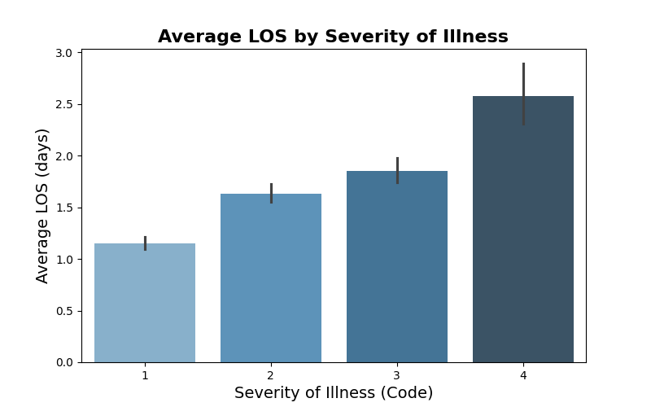

# Hospital Stay Duration Analysis

# Module 17: Practical Application 3: Comparing-Classifiers

## Overview

This project analyzes a comprehensive hospital dataset from New York State to understand and predict the length of patient hospital stays. It involves exploratory data analysis, feature engineering, and predictive modeling using regression techniques.

Dataset Description 
The dataset contains records of hospital stays including patient demographics, admission details, clinical severity scores, financial charges, and outcomes.

Dataset

- **Rows:** 1,000 (sample)  
- **Columns:** 33 originally → reduced to 22 after cleaning
  
## Notebooks
- promptt.ipynb: [link to colab notebook code](https://colab.research.google.com/drive/1Bvc1XTSsyqYRLFSvz2UCU42tIPxt9cJB?usp=sharing)
## Data Description 
### Feature Groups

Patient Demographics
- age_group → Age ranges (e.g., 0–17, 18–29, 30–49, 50–69, 70+)Useful for grouping patients by age category.
- gender → Male/Female/Other. race → Race categories (White, Black, Asian/Pacific Islander, Other).
- ethnicity → Hispanic / Non-Hispanic.
- zip_code_3_digits → First 3 digits of patient ZIP (for geography).
Admission & Discharge Information
- type_of_admission → How patient was admitted: Emergency, Elective, Trauma, Newborn.
- patient_disposition → Status at discharge: home, rehab, skilled nursing, expired, transferred.
- emergency_department_indicator → Y/N if admitted via ED.
- discharge_year → Year of discharge (time-based trends).
Clinical Classifications
- ccsr_diagnosis_code / ccsr_diagnosis_description → Diagnosis category (based on ICD → CCSR grouping).
- ccsr_procedure_code / ccsr_procedure_description → Procedure category.
- apr_drg_code / apr_drg_description → All-Patient Refined DRG (Diagnosis Related Group).
- apr_mdc_code / apr_mdc_description → Major Diagnostic Category.
- apr_severity_of_illness_code / apr_severity_of_illness → Severity level (1=Minor, 2=Moderate, 3=Major, 4=Extreme).
- apr_risk_of_mortality → Mortality risk category (Minor, Moderate, Major, Extreme).
- apr_medical_surgical → Medical vs Surgical case.
Hospital Identifiers
- hospital_service_area → Regional service area.
- hospital_county → County where hospital is located.
- facility_name → Hospital facility name.
- operating_certificate_number, permanent_facility_id → Hospital identifiers.
Financial Variables
- payment_typology_1 / 2 / 3 → Primary, secondary, tertiary payer (Medicare, Medicaid, private insurance, self-pay).
- total_charges → Amount billed to patient/insurer.
- total_costs → Estimated hospital cost of the stay.
Outcome Variable
- length_of_stay → Number of days patient stayed in hospital (integer, sometimes capped as “120+”).
- Target for regression.
- Distribution is usually right-skewed (most short stays, few very long ones).

## Data Cleaning/Preprocessing
### Data Cleaning 
several columns were removed to ensure only meaningful and usable features were retained:
- **Identifiers:** `operating_certificate_number`, `permanent_facility_id`, `facility_name`  
- **Leakage-prone variables:** `total_charges`, `total_costs` (known only post-discharge)  
- **Sparse/Redundant:** `payment_typology_2`, `payment_typology_3`, `birth_weight`, `zip_code_3_digits`  
- **Overlapping:** `ccsr_procedure_code`, `ccsr_procedure_description`  

### Preprocessing/Feature Engineering
#### Categorical Features
- Applied One-Hot Encoding to variables like type of admission, patient disposition, APR severity of illness, and risk of mortality.
- Used drop-first encoding for binary categories to prevent multicollinearity.
#### Numerical Features
- Retained integer-based fields such as severity codes and discharge year.
- Considered scaling (StandardScaler) for continuous variables to support algorithms sensitive to feature magnitude.

#### Feature Selection Considerations
- Dropped financial outcomes (total_charges, total_costs) since they are only known post-discharge.
- Removed identifiers (facility name, operating certificate number, permanent facility ID) that don’t provide predictive value.
- Excluded sparse or redundant fields (payment_typology_2/3, birth_weight, zip_code_3_digits, procedure codes) due to missingness or overlap with diagnosis/severity features.

#### Train/Test Split
- Split data into 80% training and 20% testing.
  
### EDA and Correlation Analysis
#### 1. Target Distribution
- The target variable y is highly imbalanced:
  - No: ~88%
  - Yes: ~12%
This imbalance highlights the need to use metrics beyond accuracy (e.g., Recall, F1, PR AUC).

#### 2. Numerical Features
###Length of Stay (LOS):
- Distribution is right-skewed, with most patients staying 2–7 days.
- Median is 3 days, but a few outliers extend up to 120 days
- Capping or log-transforming LOS could help stabilize modeling.
###Severity of Illness Code (numeric 1–4):
- LOS increases stepwise with the severity code.
- Acts as an ordinal variable and aligns well with the categorical severity labels.
- 
  

#### 3. Categorical Features

Type of Admission:
- Emergency admissions dominate and show longer LOS on average.
- Elective admissions tend to be shorter, reflecting planned care.
- Newborn admissions are short but with some outliers.

Severity of Illness:
- Extreme severity patients have the longest median LOS.
- Clear gradient: Minor → Moderate → Major → Extreme.
- One of the strongest predictors of LOS.

Risk of Mortality:
- Higher mortality risk correlates with longer LOS, though extreme-risk patients show greater variability (some very short stays due to death).
- Strong complement to severity.

Age Group:
- Older patients (especially 70+) stay significantly longer.
- Younger groups (0–17, 18–29) show shorter stays.
- Age amplifies Medicare’s effect on LOS.

Patient Disposition:
- Home discharges have the shortest stays.
- Transfers to rehab/skilled nursing show much longer LOS.
- Expired patients show a split: some very short stays, others very long.

Payment Typology 1:
- Medicare patients have the longest stays, linked to age and comorbidities.
- Private insurance/self-pay generally result in shorter LOS.
- Reflects both demographic and system-level influences.

---

## Model Performance Summary (with Cross-Validation):

### Run 1: Dummy Model

### Run 2: BaseLine model 

  
### Top Categorical Features 

### Top Numerical Features 

## Key Features in Correlation to y

Top Features

## Next Steps & Recommendations

